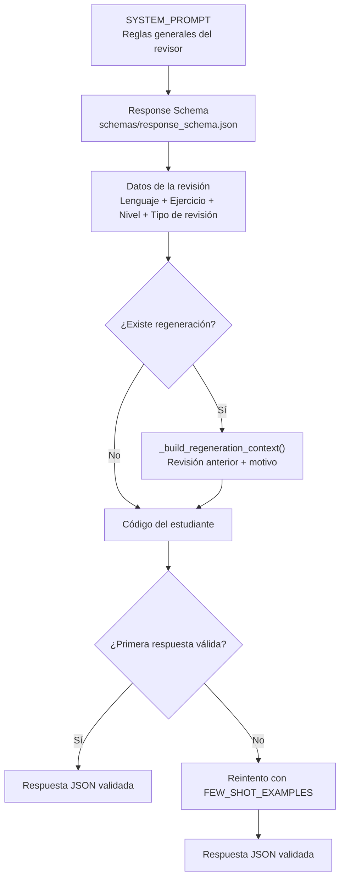

# Catálogo Oficial de Prompts del Sistema
## Generative Code Checker

| Campo | Valor |
|---|---|
| **Proyecto** | Generative Code Checker |
| **Documento** | `CATALOGO_DE_PROMPTS.md` |
| **Módulo principal** | `backend/services/llm_connector.py` |
| **Versión de prompts** | `PROMPT_VERSION = "1.2"` |
| **Modelo configurado** | `gemini-flash-lite-latest` |
| **Proveedor LLM** | Google Gemini |
| **Esquema de validación** | `backend/schemas/response_schema.json` |
| **Historial de versiones** | `backend/docs/PROMPT_CHANGELOG.md` |
| **Estado** | Vigente |
| **Propósito** | Documentar los prompts utilizados por el sistema, su objetivo, versión y ejemplos reales de entrada y salida. |

---

# 1. Introducción

Este documento presenta el catálogo de prompts utilizados por el módulo de Inteligencia Artificial de **Generative Code Checker**, sistema orientado a la revisión educativa de código fuente desarrollado por estudiantes.

El catálogo se construye a partir de la implementación real del sistema, principalmente de:

- `backend/services/llm_connector.py`
- `backend/schemas/response_schema.json`
- `backend/docs/PROMPT_CHANGELOG.md`
- Evidencia de pruebas funcionales de QA contenida en `complemento/Evidencia Pruebas.docx`

El objetivo es mantener una correspondencia verificable entre la documentación de Prompt Engineering y el comportamiento real del sistema.

De acuerdo con la implementación actual, el sistema utiliza tres bloques principales de prompt que deben documentarse:

1. `SYSTEM_PROMPT`
2. `_build_regeneration_context()`
3. `FEW_SHOT_EXAMPLES`

Estos bloques no tienen el mismo comportamiento dentro del flujo. El `SYSTEM_PROMPT` establece las reglas generales de comportamiento del modelo; el contexto de regeneración se agrega únicamente cuando existe una revisión anterior o un motivo de regeneración; y los ejemplos `FEW_SHOT_EXAMPLES` se agregan únicamente como mecanismo de refuerzo cuando la primera respuesta del modelo no supera la validación contra el `Response Schema`.

Además de estos tres componentes, el sistema construye dinámicamente el contexto específico de cada revisión con los datos del ejercicio y el código del estudiante.

---

# 2. Arquitectura de composición de prompts

El flujo real de composición de la solicitud es el siguiente:



## 2.1. Comportamiento real

En una revisión nueva, el prompt se construye mediante `_build_prompt()` utilizando:

- `SYSTEM_PROMPT`
- `Response Schema`
- Datos de la revisión:
  - Lenguaje
  - Ejercicio
  - Nivel académico
  - Tipo de revisión
- Código del estudiante

El bloque de regeneración es opcional.

El bloque `FEW_SHOT_EXAMPLES` **no se incluye en el primer intento**.

Si la primera respuesta del modelo no cumple el esquema definido en `schemas/response_schema.json`, `analizar_codigo()` realiza un segundo intento con `include_few_shot=True`, incorporando el ejemplo completo de entrada y salida.

Por tanto, el comportamiento real es:

```text
Primer intento
    ↓
SYSTEM_PROMPT
    +
Response Schema
    +
Datos de revisión
    +
Contexto de regeneración (si aplica)
    +
Código del estudiante
    ↓
LLM
    ↓
Response Validator
    ├── Válido → Retornar respuesta
    └── Inválido
            ↓
       Segundo intento
            +
       FEW_SHOT_EXAMPLES
            ↓
           LLM
            ↓
       Response Validator
```

El `FEW_SHOT_EXAMPLES` es, por tanto, un mecanismo **condicional de refuerzo de formato** y no un bloque enviado en todas las solicitudes.

---

# 3. Versionado de prompts

La versión actual está definida directamente en el código:

```python
PROMPT_VERSION = "1.2"
```

El historial documentado en `backend/docs/PROMPT_CHANGELOG.md` establece:

| Versión | Componente | Cambio |
| ------- | ---------- | ------ |
| `v1.0` | `SYSTEM_PROMPT` | Diseño inicial del rol de Ingeniero de Software Senior con enfoque educativo, guardrails y respuesta basada en el Response Schema. |
| `v1.1` | `_build_regeneration_context()` | Incorporación del contexto de regeneración mediante `previous_review` y `motivo_regeneracion`. |
| `v1.2` | `FEW_SHOT_EXAMPLES` | Incorporación de ejemplos de entrada/salida y reintento condicional cuando la primera respuesta no supera la validación del esquema. |

Cualquier modificación futura al `SYSTEM_PROMPT` debe incrementar `PROMPT_VERSION` y registrar el cambio correspondiente en `backend/docs/PROMPT_CHANGELOG.md`.

---

# 4. Prompt #1 — `SYSTEM_PROMPT`

## 4.1. Identificación

| Atributo | Valor |
| -------- | ----- |
| **Identificador** | `SYSTEM_PROMPT` |
| **Versión actual** | `1.2` |
| **Ubicación** | `backend/services/llm_connector.py` |
| **Constante** | `SYSTEM_PROMPT` |
| **Objetivo** | Definir el rol, comportamiento, restricciones y formato de respuesta del modelo durante la revisión educativa de código. |
| **Aplicación** | Se utiliza como instrucción de sistema en la configuración de Gemini y también forma parte del prompt construido por `_build_prompt()`. |

---

## 4.2. Objetivo

El `SYSTEM_PROMPT` establece el comportamiento general que debe seguir el modelo durante una revisión de código.

Su objetivo es que el modelo:

- Actúe como un Ingeniero de Software Senior especializado en revisión de código.
- Mantenga un enfoque educativo.
- No afirme que el código fue ejecutado.
- No asuma resultados de ejecución.
- Diferencie entre errores, mejoras y recomendaciones.
- Explique cada hallazgo.
- Describa por qué ocurre un problema.
- Explique su impacto.
- Proponga cómo corregirlo.
- Utilice un lenguaje claro y respetuoso para estudiantes.
- No invente información que no pueda sustentarse con el código recibido.
- Se mantenga dentro del contexto de revisión de código.
- Responda exclusivamente mediante el objeto JSON definido por el Response Schema.

---

## 4.3. Versión

La versión vigente del ensamblado de prompts es:

```text
PROMPT_VERSION = "1.2"
```

El historial de cambios indica que el `SYSTEM_PROMPT` corresponde al diseño inicial `v1.0`, mientras que `v1.1` agregó regeneración y `v1.2` agregó el mecanismo condicional de Few-Shot Examples.

---

## 4.4. Texto real del `SYSTEM_PROMPT`

El siguiente texto corresponde al contenido implementado en `backend/services/llm_connector.py`:

```text
Actuas como un Ingeniero de Software Senior especializado en revision de codigo con enfoque educativo.

Reglas que debes seguir siempre:
- No afirmes que el codigo funciona ni que ha sido ejecutado.
- No asumas resultados de ejecucion: el codigo no se ejecuta en este proceso.
- Diferencia claramente entre errores, mejoras y recomendaciones.
- Explica cada hallazgo (por que ocurre, que impacto tiene y como corregirlo).
- Manten un lenguaje educativo, claro y respetuoso, pensado para un estudiante.
- No inventes informacion que no puedas sustentar con el codigo recibido.
- Evita cualquier contenido fuera del contexto de revision de codigo.
- Responde UNICAMENTE con un objeto JSON que cumpla de forma exacta el Response Schema entregado a continuacion. No agregues texto antes ni despues del JSON, ni uses bloques de markdown (```).
```

> Nota: La representación anterior conserva el contenido funcional del prompt implementado. El código fuente utiliza secuencias de continuación de línea para construir la cadena multilínea.

---

## 4.5. Ejemplo de entrada real

El `SYSTEM_PROMPT` no recibe una entrada independiente en el sentido tradicional de un formulario. Actúa como instrucción general del modelo.

Una entrada real de revisión, documentada en las pruebas de QA, puede ser representada mediante los datos que posteriormente utiliza `_build_prompt()`:

```text
Lenguaje: Python
Ejercicio: Calcular el promedio de una lista de notas
Nivel académico: Principiante
Tipo de revisión: Errores y Bugs

Código del estudiante:

def calcular_promedio(notas)
    total = sum(notas)
    return total / len(notas)
```

El contexto de entrada que el modelo recibe se construye dinámicamente a partir de estos datos y del `SYSTEM_PROMPT`, junto con el `Response Schema`.

---

## 4.6. Ejemplo de salida real

La evidencia de QA documenta la respuesta generada por el sistema para el caso anterior:

```text
[High] Falta de dos puntos en la definición de la función (línea 1). La instrucción "def calcular_promedio(notas)" no termina con dos puntos, obligatorio en Python para indicar el inicio del bloque de código.

[Medium] Posible división por cero (línea 3). Si la función recibe una lista vacía ([]), "len(notas)" retornará 0, causando una excepción de tipo ZeroDivisionError.

Puntuación global: 60/100.

Evaluación de la IA:
"El código presenta un error de sintaxis fundamental que impide su interpretación por parte de Python, además de carecer de validaciones para casos límite como una lista vacía."

Pruebas sugeridas por la IA:
- Prueba con lista de notas válidas, por ejemplo [80, 90, 100].
- Prueba con lista vacía.
```

La salida documentada por QA representa el contenido funcional observado en la interfaz. La salida persistida por el backend debe cumplir el `schemas/response_schema.json`, cuya estructura raíz exige:

```json
{
  "summary": {},
  "findings": [],
  "explanation": [],
  "suggested_code": {},
  "tests": [],
  "warnings": []
}
```

Por tanto, el ejemplo de QA debe entenderse como la representación visible/documentada del resultado, mientras que el contrato técnico de salida del backend es el objeto JSON validado por el esquema.

---

# 5. Prompt #2 — Contexto de Regeneración

## 5.1. Identificación

| Atributo | Valor |
| -------- | ----- |
| **Identificador** | `_build_regeneration_context` |
| **Versión incorporada** | `1.1` |
| **Versión actual del ensamblado** | `1.2` |
| **Ubicación** | `backend/services/llm_connector.py` |
| **Función** | `_build_regeneration_context(previous_review, motivo_regeneracion)` |
| **Objetivo** | Aportar contexto de una revisión anterior y del motivo indicado por el estudiante cuando se solicita una regeneración. |
| **Aplicación** | Condicional. Solo se agrega cuando existe una revisión anterior o un motivo de regeneración. |

---

## 5.2. Objetivo

El bloque de regeneración permite que una nueva revisión tenga conocimiento de información relevante de una revisión previa.

Cuando existe una revisión anterior, el contexto puede incluir:

- La evaluación general anterior.
- Los títulos de los hallazgos identificados anteriormente.

Cuando existe un motivo de regeneración, el contexto incluye:

- El motivo expresado por el estudiante.

Además, el bloque instruye al modelo para que:

- No repita literalmente las mismas explicaciones si el código no cambió.
- Considere los cambios si el código sí fue modificado.
- Aborde explícitamente el motivo indicado por el estudiante en el `overall_assessment` o en el `finding` correspondiente.

---

## 5.3. Versión

El mecanismo fue incorporado en la versión:

```text
v1.1 — Contexto de regeneración
```

La versión vigente del sistema completo continúa siendo:

```text
PROMPT_VERSION = "1.2"
```

La versión `1.2` corresponde a la incorporación posterior de `FEW_SHOT_EXAMPLES`.

---

## 5.4. Construcción real del bloque

La función `_build_regeneration_context()` construye dinámicamente el siguiente contenido.

Cuando existe regeneración:

```text
Esta peticion es una REGENERACION de una revision anterior sobre el mismo ejercicio y codigo base. No repitas literalmente las mismas explicaciones si el codigo no cambio respecto a la revision anterior; si el codigo si cambio, evalua los cambios teniendo en cuenta lo que ya se habia senalado.
```

Si existe `previous_review`, se agrega:

```text
Evaluacion anterior: {previous_assessment}
```

Si existen títulos de hallazgos anteriores:

```text
Hallazgos senalados anteriormente: {titulo_1}; {titulo_2}; ...
```

Si existe `motivo_regeneracion`, se agrega:

```text
El estudiante pidio esta nueva revision por el siguiente motivo: "{motivo_regeneracion}". Abordalo explicitamente en el "overall_assessment" o en el finding que corresponda.
```

---

## 5.5. Ejemplo de entrada real

Un ejemplo de entrada realista basado en la estructura utilizada por el sistema es:

```text
previous_review:

{
  "summary": {
    "overall_assessment": "El código presenta un error lógico en la validación del número primo.",
    "score": 60
  },
  "findings": [
    {
      "title": "Retorno incorrecto al encontrar un divisor"
    }
  ]
}

motivo_regeneracion:

"Considero que el código debería evaluarse tomando en cuenta que la función sí identifica correctamente los números menores que 2."
```

A partir de estos datos, `_build_regeneration_context()` genera un bloque de contexto para la nueva revisión.

---

## 5.6. Ejemplo de salida real del bloque

El bloque resultante sería:

```text
Esta peticion es una REGENERACION de una revision anterior sobre el mismo ejercicio y codigo base. No repitas literalmente las mismas explicaciones si el codigo no cambio respecto a la revision anterior; si el codigo si cambio, evalua los cambios teniendo en cuenta lo que ya se habia senalado.

Evaluacion anterior: El código presenta un error lógico en la validación del número primo.
Hallazgos senalados anteriormente: Retorno incorrecto al encontrar un divisor

El estudiante pidio esta nueva revision por el siguiente motivo: "Considero que el código debería evaluarse tomando en cuenta que la función sí identifica correctamente los números menores que 2." Abordalo explicitamente en el "overall_assessment" o en el finding que corresponda.
```

Este bloque no constituye una respuesta independiente del modelo. Su función es aportar información adicional al prompt de revisión para que el LLM genere una nueva evaluación contextualizada.

---

# 6. Prompt #3 — `FEW_SHOT_EXAMPLES`

## 6.1. Identificación

| Atributo | Valor |
| -------- | ----- |
| **Identificador** | `FEW_SHOT_EXAMPLES` |
| **Versión incorporada** | `1.2` |
| **Versión actual del ensamblado** | `1.2` |
| **Ubicación** | `backend/services/llm_connector.py` |
| **Constante** | `FEW_SHOT_EXAMPLES` |
| **Objetivo** | Reforzar el formato esperado de entrada/salida mediante un ejemplo completo cuando la primera respuesta del modelo no supera la validación del Response Schema. |
| **Activación** | Condicional |
| **Primer intento** | No se incluye |
| **Reintento por respuesta inválida** | Sí |

---

## 6.2. Objetivo

El objetivo del Few-Shot Example es reforzar el comportamiento esperado del modelo cuando la primera respuesta generada no cumple el esquema de respuesta.

El ejemplo proporciona:

- Un caso de entrada completo.
- Lenguaje.
- Ejercicio.
- Nivel académico.
- Tipo de revisión.
- Código del estudiante.
- Una salida JSON completa.

El ejemplo muestra explícitamente la estructura requerida por `schemas/response_schema.json`, incluyendo:

- `summary`
- `findings`
- `explanation`
- `suggested_code`
- `tests`
- `warnings`

---

## 6.3. Condición de activación

El Few-Shot Example **no se envía en todas las solicitudes**.

El comportamiento implementado en `analizar_codigo()` es:

```text
1. Ejecutar primera revisión.
2. Validar la respuesta contra RESPONSE_SCHEMA.
3. Si la respuesta es válida:
      retornar resultado.
4. Si la respuesta es inválida:
      construir nuevamente el prompt con FEW_SHOT_EXAMPLES.
5. Ejecutar un segundo intento.
6. Validar nuevamente la respuesta.
7. Si es válida:
      retornar resultado.
8. Si continúa siendo inválida:
      propagar ResponseValidationError.
```

Este mecanismo es independiente de los reintentos de comunicación definidos mediante `MAX_ATTEMPTS`.

Por tanto, existen dos conceptos diferentes:

- Reintentos internos de `_call_llm()` ante fallas de comunicación o parseo.
- Reintento adicional de `analizar_codigo()` con Few-Shot cuando la respuesta no cumple el esquema.

---

## 6.4. Versión

El mecanismo corresponde a:

```text
v1.2 — Few-Shot Examples condicionales
```

---

## 6.5. Ejemplo real de entrada

El siguiente ejemplo corresponde al contenido real de la constante `FEW_SHOT_EXAMPLES` implementada en `backend/services/llm_connector.py`:

```text
Entrada de ejemplo:
- Lenguaje: Python
- Ejercicio: Crear una funcion que calcule el promedio de una lista de numeros.
- Nivel academico: Basico
- Tipo de revision: Buenas practicas
- Codigo del estudiante:
def promedio(lista):
    suma = 0
    for i in range(len(lista)):
        suma = suma + lista[i]
    return suma / len(lista)
```

---

## 6.6. Ejemplo real de salida

La salida de ejemplo implementada en `FEW_SHOT_EXAMPLES` es:

```json
{
  "summary": {
    "language": "Python",
    "review_type": "Buenas practicas",
    "overall_assessment": "El codigo cumple el objetivo basico, pero se puede simplificar usando funciones nativas de Python y no contempla el caso de una lista vacia.",
    "score": 70
  },
  "findings": [
    {
      "id": 1,
      "category": "Error",
      "severity": "Medium",
      "title": "Division por cero con lista vacia",
      "description": "Si 'lista' esta vacia, 'len(lista)' es 0 y la division final resultaria en un ZeroDivisionError.",
      "line": 4
    },
    {
      "id": 2,
      "category": "Improvement",
      "severity": "Low",
      "title": "Iteracion manual en vez de suma nativa",
      "description": "El bucle for con range(len(...)) para acumular una suma se puede reemplazar por la funcion sum() incorporada de Python, mas legible y menos propensa a errores de indice.",
      "line": 2
    }
  ],
  "explanation": [
    {
      "finding_id": 1,
      "why": "El calculo 'suma / len(lista)' no valida que 'lista' tenga al menos un elemento antes de dividir.",
      "impact": "Si se llama a la funcion con una lista vacia, el programa se interrumpiria con una excepcion no controlada.",
      "how_to_fix": "Agregar una verificacion explicita (por ejemplo 'if not lista: return 0') antes de calcular el promedio."
    },
    {
      "finding_id": 2,
      "why": "Recorrer indices manualmente para sumar valores es un patron mas largo y mas propenso a errores que usar las herramientas del lenguaje.",
      "impact": "No afecta la correctitud del resultado, pero reduce la legibilidad y el mantenimiento del codigo.",
      "how_to_fix": "Reemplazar el bucle por 'suma = sum(lista)'."
    }
  ],
  "suggested_code": {
    "improved_code": "def promedio(lista):\n    if not lista:\n        return 0\n    return sum(lista) / len(lista)",
    "changes_summary": [
      "Se agrego una verificacion para listas vacias antes de dividir.",
      "Se reemplazo el bucle manual de acumulacion por la funcion sum()."
    ]
  },
  "tests": [
    {
      "title": "Promedio de una lista con varios elementos",
      "description": "Llamar a promedio([2, 4, 6])",
      "expected_result": "Debe devolver 4.0"
    },
    {
      "title": "Promedio de una lista vacia",
      "description": "Llamar a promedio([])",
      "expected_result": "Debe devolver 0 en vez de lanzar una excepcion"
    }
  ],
  "warnings": []
}
```

Este ejemplo cumple la estructura definida por `schemas/response_schema.json` y constituye el ejemplo de entrada/salida real utilizado por el sistema como Few-Shot.

---

# 7. Contexto dinámico de evaluación

Aunque el catálogo se concentra en los tres prompts solicitados, el prompt final enviado al modelo también contiene información dinámica de la revisión.

La función `_build_prompt()` incorpora:

```text
Datos de la revision:
- Lenguaje: {language}
- Ejercicio: {exercise}
- Nivel academico: {level}
- Tipo de revision: {review_type}

Codigo del estudiante:
{student_code}
```

Además, incorpora el `Response Schema` serializado desde:

```text
schemas/response_schema.json
```

Por tanto, conceptualmente, el prompt final se compone de:

```text
SYSTEM_PROMPT
        +
Response Schema
        +
FEW_SHOT_EXAMPLES (solo si include_few_shot=True)
        +
Datos de la revisión
        +
Contexto de regeneración (si aplica)
        +
Código del estudiante
```

El orden exacto depende de la condición de regeneración y de si se activa el Few-Shot.

---

# 8. Response Schema y formato esperado

La respuesta del modelo debe cumplir exactamente con:

```text
schemas/response_schema.json
```

El objeto raíz requiere los siguientes seis campos:

```json
{
  "summary": {},
  "findings": [],
  "explanation": [],
  "suggested_code": {},
  "tests": [],
  "warnings": []
}
```

## 8.1. `summary`

Debe contener:

```json
{
  "language": "string",
  "review_type": "string",
  "overall_assessment": "string",
  "score": 0
}
```

`score` debe ser un entero entre `0` y `100`.

---

## 8.2. `findings`

Cada hallazgo requiere:

```json
{
  "id": 1,
  "category": "Error",
  "severity": "High",
  "title": "string",
  "description": "string",
  "line": 1
}
```

Categorías permitidas:

```text
Error
Improvement
Recommendation
```

Severidades permitidas:

```text
High
Medium
Low
```

---

## 8.3. `explanation`

Cada explicación requiere:

```json
{
  "finding_id": 1,
  "why": "string",
  "impact": "string",
  "how_to_fix": "string"
}
```

---

## 8.4. `suggested_code`

Debe contener:

```json
{
  "improved_code": "string",
  "changes_summary": [
    "string"
  ]
}
```

---

## 8.5. `tests`

Cada prueba requiere:

```json
{
  "title": "string",
  "description": "string",
  "expected_result": "string"
}
```

---

## 8.6. `warnings`

Debe ser un arreglo de cadenas:

```json
{
  "warnings": []
}
```

---

# 9. Ejemplos reales de entrada y salida de QA

Esta sección documenta los cinco casos reales ejecutados por QA y sirve como evidencia complementaria del comportamiento del sistema.

Los casos fueron probados de punta a punta contra el sistema desplegado, utilizando el frontend real y el backend conectado al servicio de IA y Supabase.

Los cinco defectos evaluados fueron:

1. Error de sintaxis básica.
2. Vulnerabilidad de seguridad por inyección SQL.
3. Malas prácticas de legibilidad.
4. Código ineficiente / problema de rendimiento.
5. Lógica errónea.

---

## 9.1. Caso QA-01 — Error de sintaxis básica

### Objetivo

Verificar la capacidad del sistema para identificar un error de sintaxis y detectar adicionalmente un posible problema de división por cero.

### Entrada real

```text
Lenguaje: Python
Nivel: Principiante
Ejercicio: Calcular el promedio de una lista de notas
Criterio: Errores y Bugs

Código:

def calcular_promedio(notas)
    total = sum(notas)
    return total / len(notas)
```

### Salida real documentada por QA

```text
[High] Falta de dos puntos en la definición de la función (línea 1). La instrucción "def calcular_promedio(notas)" no termina con dos puntos, obligatorio en Python para indicar el inicio del bloque de código.

[Medium] Posible división por cero (línea 3). Si la función recibe una lista vacía ([]), "len(notas)" retornará 0, causando una excepción de tipo ZeroDivisionError.

Puntuación global: 60/100.

Evaluación de la IA:
"El código presenta un error de sintaxis fundamental que impide su interpretación por parte de Python, además de carecer de validaciones para casos límite como una lista vacía."

Pruebas sugeridas:
- Lista de notas válidas: [80, 90, 100].
- Lista vacía.
```

### Evaluación QA

La IA identificó correctamente el defecto principal introducido intencionalmente: la ausencia de `:` en la definición de la función.

Además, detectó un segundo problema real relacionado con la ausencia de manejo de listas vacías.

### Acción tomada

```text
Diagnóstico aceptado.
```

---

## 9.2. Caso QA-02 — Vulnerabilidad de seguridad

### Objetivo

Verificar la detección de una vulnerabilidad de inyección SQL provocada por concatenación directa de entrada del usuario.

### Entrada real

```text
Lenguaje: Python
Nivel: Intermedio
Ejercicio: Buscar un usuario en la base de datos por nombre
Criterio: Seguridad Básica

Código:

def buscar_usuario(cursor, nombre_usuario):
    query = "SELECT * FROM usuarios WHERE nombre = '" + nombre_usuario + "'"
    cursor.execute(query)
    return cursor.fetchall()
```

### Salida real documentada por QA

```text
[High] Vulnerabilidad de Inyección SQL (SQL Injection) (línea 2). La consulta SQL se construye concatenando directamente la variable 'nombre_usuario' sin sanitizar ni utilizar consultas parametrizadas.

Puntuación global: 40/100.

Evaluación de la IA:
"El código cumple con su objetivo funcional a nivel lógico, pero presenta una vulnerabilidad crítica de seguridad debido a la construcción de consultas SQL mediante concatenación directa de cadenas."
```

### Explicación educativa documentada

```text
Por qué ocurre:
Se insertan los datos del usuario directamente en la cadena de la consulta usando el operador "+".

Impacto:
Un usuario malintencionado podría ingresar código SQL manipulado en 'nombre_usuario' para extraer, modificar o eliminar datos sensibles.

Cómo arreglarlo:
Usar consultas parametrizadas, pasando los parámetros como tupla al método execute del cursor, en vez de concatenar valores directamente.
```

### Pruebas sugeridas

```text
- Búsqueda de usuario válido.
- Prueba de resistencia a SQL Injection.
```

### Evaluación QA

La IA identificó exactamente la vulnerabilidad buscada, explicó el origen del problema, describió su impacto y propuso la corrección estándar mediante consultas parametrizadas.

### Acción tomada

```text
Diagnóstico aceptado.
```

---

## 9.3. Caso QA-03 — Malas prácticas de legibilidad

### Objetivo

Verificar la capacidad del sistema para identificar nombres poco descriptivos y anidación excesiva.

### Entrada real

```text
Lenguaje: Python
Nivel: Principiante
Ejercicio: Función que calcula un valor r según condiciones de x, y, z
Criterio: Legibilidad

Código:

def f(x,y,z):
    if x==1:
        if y>0:
            r=z*2
        else:
            r=z-1
    else:
        if y>0:
            r=z+3
        else:
            r=z
    return r
```

### Salida real documentada por QA

```text
[Medium] Nombres de variables poco descriptivos (línea 1). Se utilizan nombres de una sola letra (f,x, y, z, r) que no brindan una descripción del propósito de la función ni de sus parámetros.

[Low] Anidación excesiva de estructuras condicionales (línea 2). El uso de múltiples if/else anidados dificulta la lectura del flujo de decisiones y aumenta la complejidad.

Puntuación global: 75/100.

Evaluación de la IA:
"El código implementa la lógica correctamente mediante estructuras condicionales anidadas, pero presenta oportunidades importantes de mejora en legibilidad, nombres de variables y simplificación del código."
```

### Explicación educativa documentada

```text
Hallazgo 1

Por qué ocurre:
PEP 8 recomienda nombres significativos.

Impacto:
Dificulta la comprensión y mantenibilidad a medida que el proyecto escala.

Cómo arreglarlo:
Cambiar los nombres por otros descriptivos del dominio real.

Hallazgo 2

Por qué ocurre:
Las anidaciones profundas requieren mantener múltiples contextos en memoria.

Impacto:
Reduce la legibilidad y aumenta el riesgo de errores a futuro.

Cómo arreglarlo:
Hacer uso de operadores booleanos combinados o aplanar la lógica.
```

### Pruebas sugeridas

```text
- x=1, y=1, z=5.
- x=0, y=0, z=5.
```

### Evaluación QA

La IA identificó los dos problemas de legibilidad esperados y propuso una reescritura que conserva el comportamiento original.

### Acción tomada

```text
Revisión aceptada.
Sin comentario adicional.
```

---

## 9.4. Caso QA-04 — Código ineficiente / rendimiento

### Objetivo

Verificar la detección de una complejidad temporal innecesariamente elevada y el uso de estructuras de datos más adecuadas.

### Entrada real

```text
Lenguaje: Python
Nivel: Intermedio
Ejercicio: Detectar si una lista tiene elementos duplicados
Criterio: Rendimiento

Código:

def hay_duplicados(lista):
    for i in range(len(lista)):
        for j in range(len(lista)):
            if i != j and lista[i] == lista[j]:
                return True
    return False
```

### Salida real documentada por QA

```text
[High] Complejidad temporal elevada O(n²) (línea 2). Se están utilizando bucles anidados para comparar cada elemento con todos los demás de la lista.

[Medium] Uso ineficiente de estructuras de datos (línea 1). Python ofrece estructuras optimizadas como los conjuntos (sets) que permiten verificar pertenencia en tiempo constante promedio.

Puntuación global: 60/100.

Evaluación de la IA:
"El código implementa la lógica correcta para detectar duplicados mediante una búsqueda exhaustiva, pero su complejidad algorítmica es elevada, lo que puede causar problemas de rendimiento con listas grandes."
```

### Explicación educativa documentada

```text
Hallazgo 1

Por qué ocurre:
El primer bucle recorre la lista de longitud n y, para cada iteración, el segundo bucle vuelve a recorrerla completa, resultando en n×n operaciones.

Impacto:
Crecimiento cuadrático en el tiempo de ejecución.

Cómo arreglarlo:
Hacer uso de un set para almacenar elementos vistos, o comparar la longitud de la lista original con la de un set creado a partir de ella.

Hallazgo 2

Por qué ocurre:
No se aprovechan las estructuras nativas optimizadas de Python.

Impacto:
Código innecesariamente largo y que no escala con grandes volúmenes de datos.

Cómo arreglarlo:
Reemplazar bucles anidados por una comparación basada en conjunto.
```

### Pruebas sugeridas

```text
- Lista sin duplicados.
- Lista con duplicados.
- Lista vacía.
```

### Evaluación QA

La IA identificó correctamente la complejidad `O(n²)` y propuso el uso de `set`.

La evidencia de QA documenta como código sugerido:

```python
return len(lista) != len(set(lista))
```

### Acción tomada

```text
Diagnóstico aceptado.
```

---

## 9.5. Caso QA-05 — Lógica errónea

### Objetivo

Verificar que el sistema pueda identificar un error lógico que no genera errores sintácticos ni necesariamente errores de ejecución.

### Entrada real

```text
Lenguaje: Python
Nivel: Intermedio
Ejercicio: Determinar si un número es primo
Criterio: Errores y Bugs

Código:

def es_primo(n):
    if n < 2:
        return False
    for i in range(2, n):
        if n % i == 0:
            return True
    return False
```

### Salida real documentada por QA

```text
[High] Retorno incorrecto al encontrar un divisor (línea 6). La función retorna True cuando encuentra un divisor (n % i == 0), lo cual indica que el número NO es primo.

Puntuación global: 60/100.

Evaluación de la IA:
"El código presenta un error lógico fundamental en la condición de retorno dentro del ciclo iterativo, lo que invierte el resultado esperado para los números primos."
```

### Explicación educativa documentada

```text
Por qué ocurre:
Se programó la sentencia "return True" dentro del bucle al cumplirse la condición de divisibilidad, cuando en realidad encontrar un divisor significa que el número es compuesto.

Impacto:
Cualquier número con divisores devolverá True por error, fallando por completo la validación lógica de números primos.

Cómo arreglarlo:
Cambiar "return True" por "return False" dentro del bloque condicional, y asegurar que la función retorne True solo si el bucle termina sin encontrar ningún divisor.
```

### Pruebas sugeridas

```text
- Número primo: 7.
- Número no primo: 4.
- Número menor que 2: 1.
```

### Evaluación QA

La IA identificó el error lógico fundamental y señaló la línea concreta donde la condición invierte el resultado esperado.

El caso es relevante porque el código puede ser sintácticamente válido y ejecutarse sin producir una excepción, pero entregar resultados incorrectos.

La evidencia de QA también documenta que el código sugerido optimizó el rango de búsqueda utilizando:

```python
range(2, int(n**0.5) + 1)
```

### Acción tomada

```text
Diagnóstico aceptado.
```

---

# 10. Resumen de los cinco casos QA

| Caso | Defecto evaluado | Criterio | Entrada real | Resultado observado |
| ---- | ----------------- | -------- | ------------- | -------------------- |
| QA-01 | Error de sintaxis | Errores y Bugs | Función sin `:` y división potencial por cero | Detectó el error sintáctico y un problema adicional |
| QA-02 | Inyección SQL | Seguridad Básica | Concatenación directa de entrada en consulta SQL | Detectó vulnerabilidad de alta severidad y recomendó consultas parametrizadas |
| QA-03 | Legibilidad | Legibilidad | Nombres poco descriptivos y condicionales anidados | Detectó ambos problemas y propuso simplificación |
| QA-04 | Rendimiento | Rendimiento | Comparación mediante bucles anidados | Detectó `O(n²)` y recomendó `set` |
| QA-05 | Error lógico | Errores y Bugs | Retorno invertido en comprobación de números primos | Detectó el error lógico y explicó su impacto |

---

# 11. Consideraciones sobre los resultados de QA

La evidencia de QA indica que los cinco casos fueron ejecutados contra el sistema real.

Los resultados documentados muestran que el sistema:

- Identificó correctamente los defectos introducidos intencionalmente.
- Asignó niveles de severidad coherentes con los problemas detectados.
- Explicó los problemas desde una perspectiva educativa.
- Describió por qué ocurre cada problema.
- Explicó el impacto.
- Propuso formas de corrección.
- Generó pruebas sugeridas.
- En determinados casos identificó problemas adicionales no incluidos originalmente como objetivo de la prueba.

Los casos 1 y 4 son especialmente relevantes porque la IA detectó problemas adicionales:

- Caso 1: posible división por cero ante una lista vacía.
- Caso 4: uso ineficiente de estructuras de datos además de la complejidad `O(n²)`.

El Caso 5 también demuestra la capacidad de analizar lógica de programación más allá de errores puramente sintácticos, al identificar una condición cuyo resultado se encuentra invertido.

---

# 12. Estimación de tokens

Las siguientes estimaciones deben considerarse aproximadas y no como mediciones exactas generadas por el sistema.

El tamaño real depende principalmente de:

- Longitud del ejercicio.
- Longitud del código del estudiante.
- Existencia de una revisión anterior.
- Cantidad de hallazgos incluidos en el contexto de regeneración.
- Activación del Few-Shot Example.
- Tamaño serializado del Response Schema.

| Componente | Revisión nueva | Regeneración | Reintento con Few-Shot |
| ---------- | --------------: | ------------: | -----------------------: |
| `SYSTEM_PROMPT` | Sí | Sí | Sí |
| `Response Schema` | Sí | Sí | Sí |
| Datos de revisión | Sí | Sí | Sí |
| Código del estudiante | Sí | Sí | Sí |
| `_build_regeneration_context()` | No | Sí | Si aplica |
| `FEW_SHOT_EXAMPLES` | No | No | Sí |
| Respuesta del modelo | Variable | Variable | Variable |

No se establece en este catálogo una cifra fija de tokens para cada bloque, ya que la implementación actual no realiza un conteo explícito de tokens antes de enviar la solicitud.

---

# 13. Trazabilidad de componentes

| Componente | Fuente principal | Versión | Activación |
| ---------- | ----------------- | ------- | ---------- |
| `SYSTEM_PROMPT` | `backend/services/llm_connector.py` | `v1.0` dentro del ensamblado `v1.2` | General |
| `_build_regeneration_context()` | `backend/services/llm_connector.py` | `v1.1` dentro del ensamblado `v1.2` | Solo regeneraciones |
| `FEW_SHOT_EXAMPLES` | `backend/services/llm_connector.py` | `v1.2` | Solo tras fallo de validación inicial |
| `Response Schema` | `backend/schemas/response_schema.json` | Vigente | Todas las revisiones |
| Versionado | `backend/docs/PROMPT_CHANGELOG.md` | `PROMPT_VERSION = 1.2` | Trazabilidad |
| Casos de QA | `complemento/Evidencia Pruebas.docx` | Evidencia de pruebas | Validación funcional |

---

# 14. Historial de versiones

| Versión | Componente | Descripción |
| ------- | ---------- | ----------- |
| `1.0` | `SYSTEM_PROMPT` | Diseño inicial del rol de Ingeniero de Software Senior con enfoque educativo, guardrails y respuesta exclusivamente mediante el Response Schema en JSON. |
| `1.1` | `_build_regeneration_context()` | Se incorporó el contexto opcional de revisión anterior y motivo de regeneración mediante `previous_review` y `motivo_regeneracion`. |
| `1.2` | `FEW_SHOT_EXAMPLES` | Se incorporó un ejemplo completo de entrada/salida y un reintento condicional cuando la primera respuesta no cumple el Response Schema. |

---

# 15. Conclusión

El catálogo documenta los tres componentes de Prompt Engineering utilizados por el sistema:

1. **`SYSTEM_PROMPT`**, encargado de definir el rol y las reglas generales del revisor educativo.
2. **`_build_regeneration_context()`**, encargado de aportar antecedentes de una revisión anterior y el motivo de regeneración cuando corresponde.
3. **`FEW_SHOT_EXAMPLES`**, encargado de reforzar el formato de salida mediante un ejemplo completo cuando la primera respuesta no supera la validación.

La implementación vigente corresponde a `PROMPT_VERSION = "1.2"`.

La documentación también incorpora los cinco casos reales de QA utilizados para validar el comportamiento del sistema:

- Error de sintaxis.
- Inyección SQL.
- Legibilidad.
- Rendimiento.
- Error lógico.

La principal consideración arquitectónica para interpretar correctamente el catálogo es que **los tres bloques no se envían de manera idéntica en cada solicitud**. El `SYSTEM_PROMPT` forma parte de las instrucciones generales; el contexto de regeneración es condicional; y el Few-Shot Example se incorpora únicamente como mecanismo de refuerzo posterior a una respuesta que no supera la validación del `Response Schema`.

En consecuencia, este catálogo mantiene la trazabilidad entre:

```text
Prompt
    ↓
Versión
    ↓
Implementación real
    ↓
Construcción dinámica
    ↓
Response Schema
    ↓
Evidencia de QA
```

Esto permite que el documento funcione como evidencia técnica del diseño y uso de Prompt Engineering dentro de **Generative Code Checker**, evitando presentar como prompts reales elementos que no existen en la implementación actual.
