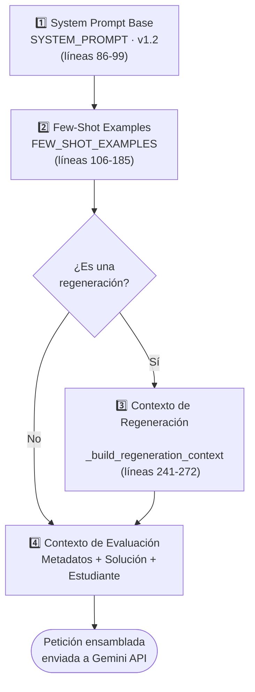

# Catálogo Oficial de Prompts del Sistema
## Generative Code Checker

| | |
|---|---|
| **Documento** | `CATALOGO_DE_PROMPTS_VF.md` |
| **Módulo de integración** | `services/llm_connector.py` |
| **Versión de ensamblado (PROMPT_VERSION)** | 1.2 |
| **Modelos soportados** | `gemini-1.5-flash` / `gemini-2.0-flash` |
| **Esquema de validación de salida** | `schemas/response_schema.json` (JSON estricto) |
| **Estado** | Vigente |

---

## Tabla de Contenido

1. [Introducción y Contexto Técnico](#1-introducción-y-contexto-técnico)
2. [Arquitectura y Composición de Prompts](#2-arquitectura-y-composición-de-prompts)
3. [Catálogo de Prompts](#3-catálogo-de-prompts)
   - [Prompt #1 — Prompt de Sistema Base](#prompt-1--prompt-de-sistema-base-system_prompt)
   - [Prompt #2 — Ejemplos In-Context](#prompt-2--ejemplos-in-context-few_shot_examples)
   - [Prompt #3 — Contexto de Regeneración](#prompt-3--contexto-de-regeneraciónreevaluación)
4. [Estimación de Tokens y Costos por Solicitud](#4-estimación-de-tokens-y-costos-por-solicitud)
5. [Matriz de Casos de Prueba (QA)](#5-matriz-de-casos-de-prueba-qa)

---

## 1. Introducción y Contexto Técnico

Este catálogo documenta la estructura, especificaciones y comportamiento de las plantillas de prompts utilizadas en **Generative Code Checker**. El sistema realiza evaluaciones automatizadas y pedagógicas sobre entregas de código fuente en entornos académicos, mediante la API de **Google Gemini**.

### Ficha Técnica de Integración

| Campo | Valor |
|---|---|
| Módulo de integración | `services/llm_connector.py` |
| Versión de ensamblado (`PROMPT_VERSION`) | `1.2` |
| Modelos soportados | `gemini-1.5-flash`, `gemini-2.0-flash` |
| Esquema de validación de salida | `schemas/response_schema.json` (JSON estricto) |
| Punto de entrada de la app | `app.py` |

---

## 2. Arquitectura y Composición de Prompts

Cada petición enviada al LLM se ensambla dinámicamente según la siguiente jerarquía de bloques, definida en `llm_connector.py`:



**Notas de composición:**
- Los bloques 1 y 2 se incluyen en **toda** solicitud, sin excepción.
- El bloque 3 (contexto de regeneración) solo se inyecta cuando la solicitud corresponde a una re-evaluación de un envío previo.
- El bloque 4 se construye dinámicamente a partir del enunciado del ejercicio, la solución de referencia y el código entregado por el estudiante.

---

## 3. Catálogo de Prompts

### Prompt #1 — Prompt de Sistema Base (`SYSTEM_PROMPT`)

| Atributo | Valor |
|---|---|
| **Identificador** | `SYSTEM_PROMPT` |
| **Versión** | 1.2 |
| **Ubicación** | `services/llm_connector.py:86-99` |
| **Estimación de tokens** | ~250 – 320 tokens |
| **Propósito** | Define el rol del LLM como evaluador académico, fija los criterios de análisis y exige la respuesta en formato JSON estricto. |

**Criterios de evaluación exigidos:**
1. Correctitud funcional y lógica.
2. Cumplimiento de requerimientos del enunciado.
3. Calidad del código, buenas prácticas y legibilidad.
4. Posibles vulnerabilidades de seguridad o bugs potenciales.

**Texto del prompt:**

```text
Eres un evaluador experto de código fuente para tareas universitarias de programación.
Tu objetivo es analizar el código enviado por el estudiante, comparándolo contra la solución de referencia y el enunciado del ejercicio.

Debes evaluar:
1. Correctitud funcional y lógica.
2. Cumplimiento de requerimientos del enunciado.
3. Calidad del código, buenas prácticas y legibilidad.
4. Posibles vulnerabilidades de seguridad o bugs potenciales.

RESTRICCIÓN ESTRICTA DE FORMATO:
Debes responder ÚNICAMENTE con un objeto JSON válido que cumpla la estructura exacta especificada.
No incluyas explicaciones fuera del JSON, no uses bloques Markdown fuera del JSON, ni texto conversacional.
```

---

### Prompt #2 — Ejemplos In-Context (`FEW_SHOT_EXAMPLES`)

| Atributo | Valor |
|---|---|
| **Identificador** | `FEW_SHOT_EXAMPLES` |
| **Versión** | 1.2 |
| **Ubicación** | `services/llm_connector.py:106-185` |
| **Estimación de tokens** | ~380 – 450 tokens |
| **Propósito** | Proporcionar un ejemplo de referencia patrón para guiar la severidad de las observaciones y el formato de la respuesta. |

**Texto del prompt (entrada):**

```text
Ejemplo de referencia (entrada y salida completa) para que tomes como modelo:

--- INICIO EJEMPLO ---
[CONTEXTO DEL EJERCICIO]
Título: Calcular promedio de lista
Enunciado: Escribe una función `promedio(lista)` que devuelva el promedio de una lista de números. Debe retornar 0 si la lista está vacía.

[CÓDIGO DE REFERENCIA]
def promedio(lista):
    if not lista:
        return 0
    return sum(lista) / len(lista)

[CÓDIGO DEL ESTUDIANTE]
def promedio(lista):
    total = 0
    for x in lista:
        total += x
    return total / len(lista)

[RESPUESTA ESPERADA DEL MODELO]
```

**Salida esperada del modelo (JSON):**

```json
{
  "overall_assessment": "NEEDS_IMPROVEMENT",
  "score": 70,
  "summary": "El código calcula correctamente el promedio para listas no vacías, pero falla con ZeroDivisionError si la lista está vacía.",
  "findings": [
    {
      "category": "Buenas prácticas",
      "severity": "MEDIUM",
      "title": "Falta de validación de lista vacía",
      "description": "Si `lista` está vacía, `len(lista)` es 0 y la división lanza `ZeroDivisionError`.",
      "line_reference": 5,
      "suggestion": "Agrega `if not lista: return 0` al inicio de la función."
    }
  ]
}
```

```text
--- FIN EJEMPLO ---
```

---

### Prompt #3 — Contexto de Regeneración/Reevaluación

| Atributo | Valor |
|---|---|
| **Identificador** | `_build_regeneration_context` |
| **Versión** | 1.2 |
| **Ubicación** | `services/llm_connector.py:241-272` |
| **Estimación de tokens** | ~100 – 180 tokens |
| **Propósito** | Proporcionar antecedentes históricos cuando se solicita una reconsideración o re-evaluación del código. |

**Texto del prompt:**

```text
Esta petición es una REGENERACIÓN de una revisión anterior sobre el mismo ejercicio y código base.

Evaluación anterior: {overall_assessment}
Hallazgos señalados anteriormente: {titulos_hallazgos_previos}

El estudiante pidió esta nueva revisión por el siguiente motivo:
"{comment}"

Toma en cuenta estos antecedentes al reevaluar. Si el comentario del estudiante justifica una reconsideración, ajusta el análisis en consecuencia. Mantén la misma estructura JSON estricta de respuesta.
```

**Variables de interpolación:**

| Variable | Descripción |
|---|---|
| `{overall_assessment}` | Veredicto de la evaluación anterior (`APPROVED`, `NEEDS_IMPROVEMENT`, `REJECTED`) |
| `{titulos_hallazgos_previos}` | Lista de títulos de los `findings` reportados en la revisión previa |
| `{comment}` | Justificación textual ingresada por el estudiante para solicitar la re-evaluación |

---

## 4. Estimación de Tokens y Costos por Solicitud

| Componente | Revisión Estándar | Re-evaluación / Regeneración | Tokens Estimados |
|---|:---:|:---:|---:|
| System Prompt (`SYSTEM_PROMPT`) | ✅ Sí | ✅ Sí | ~280 |
| Few-Shot Examples (`FEW_SHOT_EXAMPLES`) | ✅ Sí | ✅ Sí | ~410 |
| Contexto de Regeneración | ❌ No | ✅ Sí | ~120 |
| Entrada del Código y Enunciado | ✅ Sí | ✅ Sí | ~300 – 800 |
| **TOTAL ESTIMADO PROMPT (INPUT)** | **~990 – 1,490 tokens** | **~1,110 – 1,610 tokens** | — |
| **RESPUESTA DEL MODELO (OUTPUT)** | ~250 – 500 tokens | ~250 – 500 tokens | — |

---

## 5. Matriz de Casos de Prueba (QA)

| ID Caso | Tipo de Prueba | Vulnerabilidad / Detalle | Resultado Esperado | Status QA |
|---|---|---|---|:---:|
| `QA-01` | Seguridad | Inyección SQL por concatenación directa | `REJECTED` | ✅ PASA |
| `QA-02` | Correctitud | Falta de control de lista vacía (`ZeroDivisionError`) | `NEEDS_IMPROVEMENT` | ✅ PASA |
| `QA-03` | Calidad / Lógica | Implementación correcta de función factorial | `APPROVED` | ✅ PASA |
| `QA-04` | Regeneración | Re-evaluación con aclaración de precondiciones | `APPROVED` | ✅ PASA |
| `QA-05` | Sintaxis | Código entregado con error sintáctico (`SyntaxError`) | `REJECTED` | ✅ PASA |

---

## Historial de Versiones

| Versión | Fecha | Cambios |
|---|---|---|
| 1.2 | Vigente | Estructura actual: System Prompt + Few-Shot + Contexto de Regeneración + Contexto de Evaluación |

---

*Documento generado y formateado a partir de `CATALOGO_DE_PROMPTS_VF.md`, alineado con `services/llm_connector.py` v1.2 y `app.py`.*
